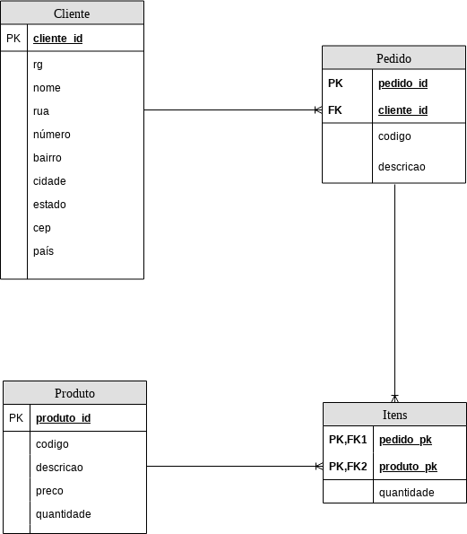

# projeto-persistence-fiap-2019

# Índice

* [Integrantes](#integrantes)
* [Modelo do Banco de Dados](#modelo-do-banco-de-dados)
* [Requisitos](#requisitos)

## Integrantes

|Nomes                       |Número de Matricula |
|----------------------------|--------------------|
|Jhonatan Oliveira de Guarda |RM333990            |
|Logan Mantovani             |RM334335            |
|Luiz Keese Tabacow          |RM334018            |

## Modelo do Banco de Dados

 

## Requisitos

Trata-se de um sistema de cadastro de produtos e pedidos em um portal de e-commerce. Considere os requisitos: 
* O portal possui vários produtos em estoque e com uma determinada quantidade em estoque de cada um desses produtos.
*  Cada pedido possui um ou mais produtos e um cliente associado a esse pedido.
*  Um produto pode aparecer em um ou mais pedidos.
*  Cada produto possui um código, um nome, uma quantidade e um valor.
*  Cada cliente possui seus dados pessoais e dados de entrega.

## Projeto exemplo

https://github.com/spring-guides/gs-accessing-data-mysql/tree/master/complete/src/main/java/hello
